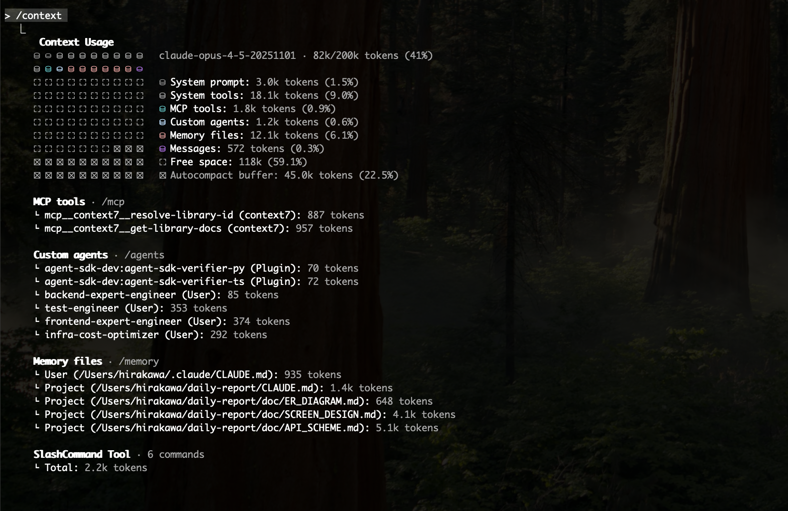

<script src="https://cdn.tailwindcss.com/"></script>
<script>tailwind.config = { corePlugins: { preflight: false } }</script>

<style scoped>
section{
  text-align:center;
}
</style>

# 「Claude Codeであなたが知るべきこと」


---

# 自己紹介

<div class="columns">
  <div>
    
  </div>
  <div>
  <p class="text-2xl">
    株式会社en-gine代表。エンジニア歴10年。<br>
    東京と福岡を拠点に、生成AI・クラウドアーキテクチャ・LLMエージェント技術を活用した業務システム・SaaSの設計開発に従事。<br>
    現在は、AIと人間の協働による「AI駆動開発（AI-Driven Development）」の普及を目指し、企業支援・教育活動も行っている。<br>
   「<a target="_blank" href="https://www.amazon.co.jp/dp/4297152754/"><strong class="orange">Claude CodeによるAI駆動開発入門</strong></a>」が技術評論社より12月5日刊行。
  </p>
  </div>
</div>

---

# 著作の紹介

12月5日刊行　日本で初めてのClaude Code刊行本<br>
「Claude CodeによるAI駆動開発入門」
教科書になることを目指しました。
<div class="columns">
  <div class="text-[28px]">
1章Claude Code入門と開発環境構築<br>
2章Claude CodeによるAI駆動開発の基礎<br>
3章MCPを活用したAIチャットボット開発<br>
4章並行処理とサブエージェントを使った開発手法<br>
5章セキュリティと応用的な活用
</div>
<div>
<a target="_blank" href="https://www.amazon.co.jp/dp/4297152754/">
  
</a>
</div>
<div>


---
<style scoped>
section{
  text-align:center;
}
</style>
# お陰様でAmazonランキング1位獲得

「ソフトウェア開発・言語」「生成AI」「コンピューター・IT」ジャンル1位
紀伊國屋書店PCフロア週間ランキング1位

12月・1月講演参加者はエンジニア1,000人

<a target="_blank" href="https://www.amazon.co.jp/dp/4297152754/">

</a>

---

# 前提

- Claude Code のインターフェースや基本操作については割愛します。
もし基本から知りたい場合はこちら⇨ <a href="./primary.html">入門者用スライド</a>

- これ聞けば最新のアップデート含め「大体抑えるべきことわかった」を目指します。
  
※ ただしClaude Codeの能力や活用方法は日々進化していますので現時点での試案的なものも含みます。


---

# 本日の御品書き

### **セクション1: 既存の機能であなたが知るべきこと**

- 知るべきスラッシュコマンド全部まとめる
- ややこしいツール群を全部まとめる

### **セクション2: 最近のアップデートであなたが知るべきこと**

  **Agent Skills, Haiku4.5 、Opus4.5、Claude Code on the Web**
    - AgentSkills ハンズオン
    - Claude Code on the Web ハンズオン

---

### **セクション3: より良い開発のためにあなたが知るべきこと**
1. コンテキストウィンドウを深掘る

2. CLAUDE.mdを深掘る

2. プロジェクトの大きさによるClaude Codeの操縦方法私案
  特に大きなプロジェクトのために・・・
    - コンテキストウィンドウを知る。それを純粋に保つ
    - コードといかに向き合うかと設計の応用

---


# この講演のゴールと効果

ドキュメントや公式Git、ブログ、アップデート全部追従し、（恐らく）隅々まで読んだ自分として、「これはまず抑えておこう」「これは知っておくと業務で便利」という情報と実践知を共有。

何となく使ってた方も、この講演で1段深く使いこなせることを目的としたお話しとなります。

---
<!--
header: セクション１：既存の知識であなたが知るべきこと
-->
# セクション１：<br>既存の知識であなたが知るべきこと

---

### **スラッシュコマンドを全部まとめる**

厳選10個ご紹介

---

- **/clear** 
会話履歴をクリアします。新しいトピックで会話を始めたい場合や、コンテキストをリセットしたい時に使用します。
話題が変わったタイミングで使用することでトークンを節約し、コンテキストを明瞭にすることができます。

- **/compact**
会話を圧縮します。オプションで圧縮時にたとえば何を残すかなどの指示を追加できます。
長い会話履歴を要約し、トークン使用量を削減したい場合に有効です。

---

- **/rewind**
会話やコードを巻き戻します。誤った変更を取り消したい場合や別の実装に変更したい場合に使用できます。
チェックポイント機能によりコードの変更も巻き戻すことができます。ただしユーザーが変更したものやコマンドにより変更したものは巻き戻しできません。Escキーを２回続けて押すことでも起動します。

- **/context**
現在のコンテキストウィンドウの占有状態を視覚的に表示します。対話のやり取りだけではなく、CLAUDE.mdのメモリーファイルやMCPサーバーなどによってどれだけ占有されているかを把握できます。

- **/resume**
過去の会話セッションを再開します。中断した作業に戻りたい場合や、以前の文脈を引き継いで作業を続けたい時に使用します。

---

- **/add-dir**
追加の作業ディレクトリを指定します。複数のディレクトリにまたがるプロジェクトで作業する際に使用します。
ただし設定は保持されず、セッションの都度追加する必要があります。

- **/init**
プロジェクト固有のルールや指示をClaudeに与えるための設定ファイルCLAUDE.mdを作成します。
CLAUDE.mdは常にClaude Codeへの指示のコンテキストの中に含まれます。

- **/config**
設定インターフェース（Configタブ）を開きます。Claude Codeの各種設定を確認、変更できます。ダークモードなどの表示テーマの変更もここから行えます。

---

- **/sandbox**
LinuxおよびMac内にて呼び出し可能です。Claude Codeの実装をネットワークとファイルシステムの分離した、サンドボックス化された内部でセキュアに行えるようになります。

- **/output-style**
このスラッシュコマンドの引数に出力スタイルを直接設定するか、選択メニューから選択します。既定ではDefault、Explanatory(説明的)、Learning（学習）の3つが用意されています。Claude Codeの応答形式や表示方法をカスタマイズできます。

⇨ スラッシュコマンド全件の解説は<a href="./slash_command.html">こちら</a>


---

## **ややこしいツール群を全部まとめる**

---

| 機能 | コンテキスト占有 | 動作タイミング | 発火 | 概略 |
|------|-----------------|--------------|----|---------|
| **スラッシュコマンド** | 小 | 明示的なコマンド実行時 | 確定的 | プロンプトをまとめておける |
| **サブエージェント** | あり | 明示的な呼び出し or 自動 | 確定的　or 確率的 | 特定の専門家を作れる |
| **Hooks** | なし | イベント時 | 確定的 | コマンドを実行できる（一部プロンプト） |
| **MCPサーバー** | やや大 | 常時接続・必要時にツール呼び出し　| 確定的 | 様々な機能と繋げられる |
| **Agent Skills** | 極小 | 自然言語で自動検出 | 確定的だがやや確率的 | 手順を与えられる  |

⇨ それぞれの詳細の解説は<a href="./custom_tools.html">こちら</a>

---
<!--
header: セクション２：最近のアップデートであなたが知るべきこと
-->
# セクション2：<br>最近のアップデートであなたが知るべきこと

Haiku4.5、Opus4.5、Agent Skills

---


# **Haiku4.5**

MAXプランでは旨みは薄い。

従量課金でコストを下げたい方や制限のキツイProプランの方向け。Haikuで思考拡張モード（Ultrathink）で実行できるのもメリット。

１週間程度Haiku4.5だけで仕事してみたが、以前のHaikuと比べたら別物のように賢く、比較的違和感なく動くことも多い。(はっきり言って設定したのを忘れてた)
ただ、特にインフラタスクやエラー対応で中々解決できない時がある印象。

**ワンショットでTODOリストを作ってみた**

```
> TODOリストのアプリケーションを作ってください。
```

  <a target="_blank" href="https://client-bi979qxxr-sutefu23s-projects.vercel.app/">https://client-bi979qxxr-sutefu23s-projects.vercel.app/</a>


---


# **Opus4.5**

現在の第一選択。

API課金でも以前の4.1の3分の1の価格。早い。MAXプランだとデフォルトで選択。

**こちらも比較のためワンショットでTODOリストを作ってみた**

<a target="_blank" href="https://todo-app-six-lilac-86.vercel.app/">https://todo-app-six-lilac-86.vercel.app/</a>

ややリッチで高度ではある。

---

## API料金まとめ

Opus4.5が料金1/3になった。

| モデル|	入力 (Input) |出力 (Output) |
| :---: | :---: | :---: |
| Opus 4.5 |	$5.00 / 100万トークン |	$25.00 / 100万トークン |
| Opus 4.1 |	$15.00 / 100万トークン|	$75.00 / 100万トークン |
| Sonnet 4.5 |	$3.00 / 100万トークン|	$15.00 / 100万トークン |
| Haiku 4.5 |	$1.00 / 100万トークン|	$5.00 / 100万トークン |


---

# Agent Skills

### 概要

Claude Codeの最新機能。特定のタスクを実行するための小さな指示書（スキル）を作成し、必要に応じて自動的に呼び出すことができる。
MCPの問題点から、コンテキストの占有を最小限に抑える設計。(name, discriptionのみ。100トークン以下)

### 設定方法
`~/.claude/skills/`配下にMDファイルを保存することで利用可能。もしくはClaude自身に作ってもらえる。


---
<style scoped>
code{
  font-size:20px;
}
</style>

### スキル構成例

定義だけではなく、より具体的な例や参考ドキュメント、実行スクリプト、出力テンプレートなども含めることができる。

```
my-skill/
├── SKILL.md (必須)
├── reference.md (オプション：コンテキストに含めたいドキュメント)
├── examples.md (オプション：具体的な例)
├── scripts/
│   └── helper.py (オプション：実行するスクリプト)
└── templates/
    └── template.txt (オプション：出力テンプレートなど)
```

### 作り方 Claude Code自身に作ってもらう
```
> 新しいスキルを作ってください。
Claude Codeのエージェントがファイルを編集し終わった後、
その編集したファイルに対してLinterを実行するスキルです。
```

---


### 使用例

特定のタスク（例：コードレビュー、テストコード生成、ドキュメント生成など）を実行するためのモジュールとして使用。

確定的な動作を行わせられる、LLMに柔軟なかつ例に沿った指示を与えられる、コンテキストを（ほとんど）占有しない。
基本的には定型化できることは第一選択としてAgent Skillsで実装するのがベスト。

---

### Skillsのメリット

- **コンテキストの最小化**: 未使用時は最低限の情報のみを提供し、無駄なコンテキスト占有を防止
- **再利用性**: 一度作成したスキルを他のプロジェクトでも利用可能
- **柔軟性**: スクリプトやテンプレートを組み合わせて複雑なタスクも実行可能。出力形式も柔軟に指定可能
- **メンテナンス性**: スキル単位での更新や改善が容易
- **拡張性**: サブエージェントから呼び出したりカスタムスラッシュコマンドから呼び出すことが可能

---

## Skills 一緒に動かしてみましょう

```
> 適当なTypeScriptの関数を.tsファイルに書いて欲しいです。
例えば数字を引数に受け取ってその数字に3がつくか、
もしくは3の倍数の時はアホになる関数を出力してください。 
```

※動かない時のコツ

CLAUDE.mdに追記
```
## コード作成後の必須事項
  - TypeScript/JavaScriptファイルを作成・編集した後は、必ず `lint-checker` スキルを実行すること
```

---
<style scoped>
section{
  font-size:27px;
}
</style>

# Claude Code on the Web

[https://claude.ai/code](https://claude.ai/code)にアクセス

GitHubリポジトリを紐づけたら開始可能。

2.0.45より`&`をつけてプロンプトを送るとClaude Code on the Webにセッションを送れるようになった！

Claude Code GitHub Actionsとの違いとメリット
- セッションとして一つ付きのやり取りが可能
- 実行にあたっては独立したブランチと環境が用意される
- Hooksやサブエージェントが使える
- 非プログラマーでも扱いやすい
- サブスクユーザーのみ対象でAPIは含まない
- メインセッションからバックグラウンドタスクとしてセッションを送れる

---

### デメリット

- 開発サーバー起動（プレビューしながら開発）などはできない
- 立ち上げるたびにサンドボックス環境にて初期化されるため、使いこなそうと思うと`npm install`などの初期化コマンドはプロジェクトの`settings.json`のHookの`Session Start`として入れておくしかない。

### 画面


---

## Claude Code on the web 一緒に動かしてみましょう

```
> & このアプリケーションの概要について説明してください。
```

---
<!--
header: セクション３：より良い開発のためにあなたが知るべきこと
-->
# **セクション3: <br>より良い開発のためにあなたが知るべきこと**

- コンテキストウィンドウを深掘る
- CLAUDE.mdを深掘る
- 中大規模開発のつらみとできること

---

# コンテキストウィンドウを深掘る

---

<!--
header: セクション３：より良い開発のためにあなたが知るべきこと：コンテキストウィンドウを深掘る
-->
# コンテキストウィンドウの仕組み

<a href="https://docs.claude.com/ja/docs/build-with-claude/context-windows" target="_blank">⇨公式ドキュメント「コンテキストウィンドウ」</a>

InputとOutputの両方を次のinputに含めて引き継いでいく。これがMAX20万トークン。
拡張思考の場合は会話のOutputに単発で含まれるが次に引き継がれない。

---
`/context`を実行してみる



---

## Contextコマンドからわかること

- 動かせないシステムプロンプトとツール（約10%）、Auto Compactを行うためののバッファ（約22%）が結構大きい。すでに30％以上を占める。

- CLAUDE.mdは常に読み込まれる。なんでも仕様を入れすぎて大きくなるのは注意。（実際CLAUDE.mdが大きすぎると警告がでるようになる）。大きくなる場合は後述する段階的読み込みを試す。

- サブエージェント、MCPは常駐する。
特にMCPは全定義ファイルが含まれる。
それらを特に便利だからといって、ユーザー設定側に入れ過ぎるのは注意。
- 常駐しなさそうなカスタムスラッシュコマンドも常駐する
```
     SlashCommand Tool · 6 commands
     └ Total: 2.2k tokens
```

---

# コンテキストウィンドウ が乱れるあるある

精度が落ちるかも、と言うことは頭に入れておく必要がある。

1. 実装をしていたら思ってもみないバグが出て解決のやり取りに時間が掛かった
2. 実装をしていたら内容について迷い始めて違うやり方でやり直し始めた
3. エラーメッセージが適切ではないものを送る。もしくは大量に関係ないものまで送る
4. IDE連携をしていてうっかり関係の無いファイルを開いて読ませてしまっている
5. CLAUDE.mdが更新されない古い情報やディレクトリ構成のまま
6. 余計なMCPサーバーのツール定義で、関係ない情報まで持っている

  基本的に`/clear`や`/rewind`をうまく使うことになります。
    ⇨ 細かい対処法は<a href="./context_keep_clearn.html">こちら</a>に記載しています　

---
## **常にコンテキストウィンドウに何が入っているかを意識する**

この３つ

⇨ **CLAUDE.md、MCP、これまでの会話、IDE連携**

---
<!--
header: セクション３：より良い開発のためにあなたが知るべきこと：CLAUDE.mdを深掘る
-->

# CLAUDE.mdを深掘る

---
# CLAUDE.mdの読み込まれるタイミング

セッション開始時に読み込まれる

---

<!--
header: セクション３：より良い開発のためにあなたが知るべきこと：コンテキストウィンドウを深掘る
-->

# Claude Codeの違和感の正体

世の中で喧伝されて、実際に手元で爆速でコード生成する便利さと、それによって拡大した複雑さと複雑さのはざまで苦しみがある


---

# プロジェクトの大きさによってClaude Codeの活躍が変わる

 - 小規模なプロジェクトはワンショット、フューショットでも可能

 - 中規模くらいまでSpec駆動などで対応できる
 
 - 大規模なプロジェクトや既存のプロジェクトでは人間の目を離れたリスク、複雑化のリスクが無視できない。


---


# 中規模以上や既存のコード上で操作するClaude Code

前提として「コンテキストを理解し意識する」「不要なコンテキストを混ぜない」

⇨ これまでの話で大体できるようになったはず。

- 如何に不確実性を下げるか
- LLMエージェントを如何に制御可能にするか
- いかにモジュール化するか
- 人間への可読性と理解をどう高めるか


---


## ポイント1：如何に不確実性を下げるか。

LLMが人間の10倍のスピードでやってくれるが
「結局どこまでどんな精度でやってくれるかはわからない」

<div class="columns">
  <div>
    
  </div>
  <div>

- 結果の不確実性<br/>
- 人間の手がどこまで入る必要があるかの判断<br/>
- 再現性の担保が難しい<br/>
### ⇨
  </div>
</div>

---

## ポイント2：LLMエージェントを如何に制御可能にするか

<div class="columns">
  <div>
    
  </div>
  <div>
- Huskeyをまずインストールする<br/>
- `/sandbox`やDockerで動かす<br/>
- Linter、FormatterはHooksもしくはSkillsで設定<br/>
  </div>
</div>

---

## ポイント3: 人間への可読性と理解をどう高めるか。

<div class="columns">
<div>


</div>
<div>
- `output-style`は`Explanation`にしておく<br/>
⇨ 「なぜそうしたか」を教えてくれる
- CLAUDE.mdのメンテナンスは怠らない。本当に必要なものだけを簡潔に書く<br/>
</div>
</div>

---
<style scoped>
section {
  text-align: center;
}
h1{
  text-align: left;
}
</style>

# オニオンアーキテクチャの観点から考える


---

## **インフラ層はコンテキストが薄い**

- インフラ層のコードは標準化しやすい
外部APIの呼出し、DB接続、認証・認可、ログ管理、ストレージサービス(S3等)への保存など
組織としてたくさん作っておくと資産になる

---

## **ドメイン層はボイラープレート化しやすい**

⇒　ドメインオブジェクトとロジックの定義ファイルからスキル化しやすい。

<div class="columns">
<div>

##### ドメインオブジェクト
```
class User {
  constructor(id, name, email) {
    this.id = id;
    this.name = name;
    this.email = email;
  }
}
```

</div>
<div>

##### ドメインサービス
```
class UserService {
  constructor(userRepository) {
    this.userRepository = userRepository;
  }

  async createUser(userData) {
    // ユーザ作成のビジネスロジック
    return this.userRepository.save(userData);
  }

  async getUserById(userId) {
    // ユーザ取得のビジネスロジック
    return this.userRepository.findById(userId);
  }
}
```

</div>

</div>

---

## **その他の層（テスト・UI）**

**単体テスト、UI層のコンポーネントもSkills化しやすい。**

**組織でテスト、UIコンポーネントのベストプラクティスの型をいち早く作っておくべき。**

UIコンポーネントはFigmaMCPサーバーで8割9割自動化できる。

GeminiCLIの方がコンテキストが長大（100万トークン）のため、可能な範囲が広い。

Claude Sonnet4.5でも100万トークン対応可能だが、APIのみなのとコストが高い。


---

# まとめ


- 予測可能性、制御可能性を高める
⇨Husky, Linter, Formatter
- 可読性、理解性を高める
⇨ドメイン駆動設計などの設計原則が役立つと思っている。

---

# 最後に

- 気軽に連絡してください。 **<a target="_blank" href="https://x.com/t_hirakawa">@t_hirakawa</a>**
導入支援や講演のご依頼も歓迎します。⇨<a href="mailto:info@en-gine.co">メール</a>

- お仕事の相談も募集中

- AIxシステム開発の引き合いも増加中。
お仲間募集中なのでカジュアル面談しましょう。
PM、エンジニア、営業（業務委託や社員登用）

---

# 質疑応答

---

# ３つのコーディングツールの強みと違い（著者調べ）

- **Claude Code**
優等生。バランスが良く、コーディングエージェントの様々な知見をいち早く盛り込む。基本間違いなし。
SkillやHook、スラッシュコマンド、サブエージェントなど、機能が多い。


- **Gemini CLI**
無料で使える範囲が大きい。
コンテキストウィンドウがデフォルトで大きい。

  仕様書理解やビジネス解像度が高い。本当に穴を理解している。
  コンテキストウィンドウが多いいからか、Figma MCPで再現が有利

---

- **Codex**
コード専用のLLMだから、コード理解がClaudeより優秀に感じることがある
Claudeと比べると遅い。2段階のプランしかない。

率でいえば、Claude Codeのシェアはわずかに下がりつつもあり、Codexが1位を取る事もあるかもしれない。


---
<style scoped>
section {
  text-align: center;
}
</style>

# 本もよろしくお願いします！<br><br>「Claude CodeによるAI駆動開発入門」

<a href="https://www.amazon.co.jp/dp/4297152754/" target="_blank"></a>
