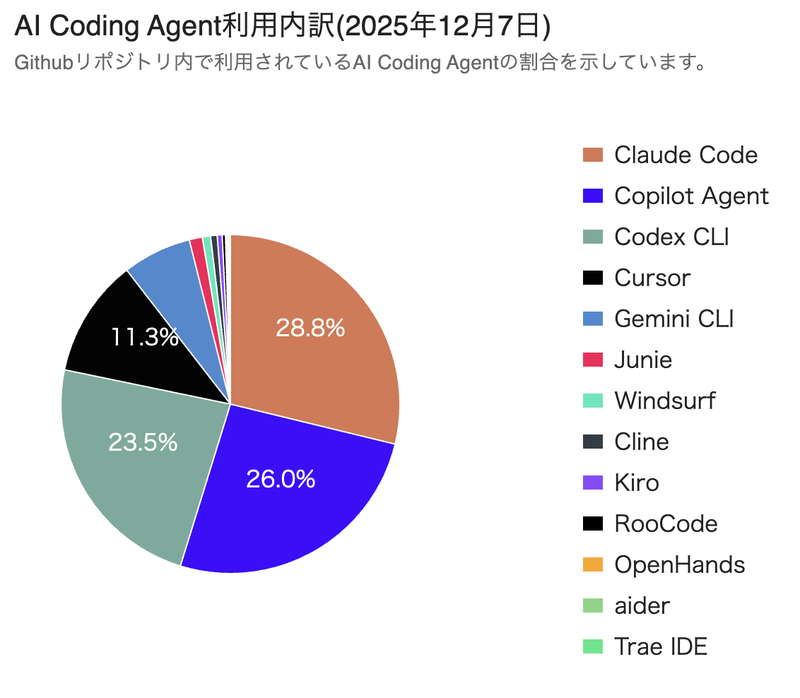

<script src="https://cdn.tailwindcss.com/"></script>
<script>tailwind.config = { corePlugins: { preflight: false } }</script>


# 著者と深掘る Claude Code×AI 駆動開発の最前線

## Lancers TechBook#1

ランサーズ テックエージェント様 主催

---
# 自己紹介

<div class="columns">
  <div>
    
  </div>
  <div>
  <p class="text-2xl">
    株式会社en-gine代表。エンジニア歴10年。<br><br>
    東京と福岡を拠点に、生成AI・クラウドアーキテクチャ・LLMエージェント技術を活用した業務システム・SaaSの設計開発に従事。<br><br>
    現在は、AIと人間の協働による「AI駆動開発（AI-Driven Development）」の普及を目指し、企業支援・教育活動も行っている。<br><br>
   「<strong class="orange">Claude CodeによるAI駆動開発入門</strong>」が技術評論社より12月5日刊行予定。
  </p>
  </div>
</div>

---
# お陰様でAmazonランキング1位獲得
<div class="columns h-100">
  <div>
「ソフトウェア開発・言語」ジャンル
  </div>
  <div>
    
  </div>
<div>

---

# Claude Code のシェア
## やや他のツールに押され気味だが依然としてシェア1位

<div class="columns h-100">
  <div>
    
  </div>
  <div>
    
  </div>
</div>

---

# 前提

- 本日はプログラマーの方が多いのでClaude Codeの基本的には使った事があることを前提とします。
- Claude Code のインターフェースや基本操作については割愛します。
- 理解しておいた方がよい事や、混乱しやすいことの整理、活用方法にフォーカスします。
- これ聞けば最新のアップデート含め「大体抑えるべきことわかった」を目指します。
- ただしClaude Codeの能力や活用方法は日々進化していますので現時点での試案的なものも含みます。

---

おまけで初心者の方向けにスライドも用意しました。

<br><i>もう少し基礎的・網羅的に知識が欲しい方は・・</i>

---

# 著作の紹介

12月5日刊行予定　日本で初めてのClaude Code刊行本<br>
「Claude CodeによるAI駆動開発入門」
現時点での教科書になることを目指しました。
<div class="columns">
  <div class="text-[28px]">
1章Claude Code入門と開発環境構築<br>
2章Claude CodeによるAI駆動開発の基礎<br>
3章MCPを活用したAIチャットボット開発<br>
4章並行処理とサブエージェントを使った開発手法<br>
5章セキュリティと応用的な活用
</div>
<div>
  
</div>
<div>


---

# 本日の御品書き

1. はじめにそこ教えてくれClaude Code
2. あまり意識に上らないけど使っておくべき機能
3. 混乱しがちな機能群と使用例まとめ
4. 最近のアップデートまとめ(Skills, Haiku4.5, Claude Code on Web)
5. プロジェクトの大きさによるClaude Codeの操縦方法
6. 質疑応答

---

# この講演のゴールと効果

本書執筆にあたってドキュメントや公式Git、ブログを（恐らく）隅々まで読んだ自分として、「これはまず抑えておこう」「これは知っておくと業務で便利」という情報と実践知を共有。

何となく使ってた方も、この1時間弱で1段階段を上がれることを目的とした講演となります。


---

# Claude Codeの違和感の正体

世の中で喧伝されて、実際に手元で爆速でコード生成する便利さと、それによって拡大した複雑さと複雑さのはざまで苦しみがある


---

# プロジェクトの大きさによってClaude Codeの活躍が変わる

 - 小規模なプロジェクトはシングルショット、フューショットで可能

---

# 最初からそこ教えてくれClaude Code


---

# Context Window を制する者はClaude Codeを制す


InputとOutputの両方を次のinputに含めて引き継いでいく。これがMAX20万トークン。
拡張思考の場合は会話のOutputに単発で含まれるが次に引き継がれない。

---

# Context Window が汚染するあるある

1. 実装をしていたら思ってもみないバグが出て解決のやり取りに時間が掛かった
2. 実装をしていたら内容について迷い始めて違うやり方でやり直し始めた
3. エラーメッセージが適切ではないものを送る。もしくは大量に関係ないものまで送る
4. IDE連携をしていてうっかり関係の無いファイルを開いて読ませてしまっている
5. CLAUDE.mdが更新されない古い情報やディレクトリ構成のまま
6. 余計なMCPサーバーのツール定義で、関係ない情報まで持っている

---

## 実装をしていたら思ってもみないバグが出て解決のやり取りに時間が掛かった

`/conpact`...会話を要約している。引数に自然言語で指定したい内容を追加するか、CLAUDE.mdの`Summary instructions`の項目に設定を追加可能。

例：`実装の変更内容にフォーカスして要約してください。`


---

## 実装をしていたら内容について迷い始めて違うやり方でやり直し始めた

`/rewind`...会話と変更ファイルをロールバック。Esc2回でも発動。
コンテキストウィンドウも戻るため、殆ど最強。

---

## エラーメッセージが適切ではないものを送る。もしくは大量に関係ないものまで送る

エラー内容をちゃんと見る勇気。

<i>バグフィックスなどはサブエージェントに対応させればコンテキストは汚染されない。</i>

---

## IDE連携をしていてうっかり関係の無いファイルを開いて読ませてしまっている

`/ide`で設定。
諸刃の剣。使っておくべき時もあるが玄人になってくると何をClaudeに渡しながらコーディングするかを頭の中で常に意識する必要がある

### CLAUDE.md、MCP、これまでの会話、IDE連携


---

`/context`で見てみましょう。

```
    Context Usage
     ⛁ ⛁ ⛁ ⛁ ⛁ ⛁ ⛁ ⛀ ⛁ ⛁   claude-sonnet-4-5-20250929 · 82k/200k tokens (41%)
     ⛁ ⛁ ⛁ ⛁ ⛁ ⛁ ⛁ ⛁ ⛶ ⛶ 
     ⛶ ⛶ ⛶ ⛶ ⛶ ⛶ ⛶ ⛶ ⛶ ⛶   ⛁ System prompt: 2.4k tokens (1.2%)
     ⛶ ⛶ ⛶ ⛶ ⛶ ⛶ ⛶ ⛶ ⛶ ⛶   ⛁ System tools: 13.4k tokens (6.7%)
     ⛶ ⛶ ⛶ ⛶ ⛶ ⛶ ⛶ ⛶ ⛶ ⛶   ⛁ MCP tools: 15.0k tokens (7.5%)
     ⛶ ⛶ ⛶ ⛶ ⛶ ⛶ ⛶ ⛶ ⛶ ⛶   ⛁ Messages: 5.8k tokens (2.9%)
     ⛶ ⛶ ⛶ ⛶ ⛶ ⛶ ⛶ ⛶ ⛶ ⛶   ⛶ Free space: 118k (59.2%)
     ⛶ ⛶ ⛶ ⛶ ⛶ ⛶ ⛶ ⛝ ⛝ ⛝   ⛝ Autocompact buffer: 45.0k tokens (22.5%)
     ⛝ ⛝ ⛝ ⛝ ⛝ ⛝ ⛝ ⛝ ⛝ ⛝ 
     ⛝ ⛝ ⛝ ⛝ ⛝ ⛝ ⛝ ⛝ ⛝ ⛝ 
```

MCPは結構食うので注意。
例えばGETしかしないのにPOSTのツール定義も読み込むため、MCPサーバーを全体に定義する時は注意。（最近問題視されてきている）

----

## CLAUDE.mdが更新されない古い構成のまま

- CLAUDE.mdの適切な分割。

  例：全体、フロントエンド、バックエンド、APIスキーマ、DBスキーマなど
  - front
  - api
  - scheme

- Hooks（最近StopとSubagentStopのみプロンプトも書けるようになった）やSkillsでファイルを作った時、セッション終了時などにプロンプトで命令しておくのはアリだと思っている。

---

# 余計なMCPサーバーのツール定義で、関係ない情報まで持っている

- Context7
- PlaywrightMCP

他にも...「サブエージェント」はコンテキストを占有する

特に~/.claudeの全体設定に入れるのは便利だが、不要なものも混じりやすいため、MCP、エージェントは気を付ける必要がある。
逆にHooks、Skills、カスタムスラッシュコマンドは常時占有するわけでは無い。

---

# あまり意識に上らないけど使っておくべき機能

---

# `/sandbox`モード

OSレベルでのファイルシステムとネットワークの分離を行い、bashツールのファイルシステムアクセスを特定のディレクトリに制限することができる。<small class="inline">(MacとLinuxのみ。Windows未対応)</small>

Dockerでコンテナ化する必要が無く便利。

```setting.json
  "sandbox": {
    "enabled": true,
    "autoAllowBashIfSandboxed": true
  }
```
このように追記すれば、設定は永続化。（ただしユーザーディレクトリに入ってる情報、例えばGlobal管理されているキャッシュをクリアして問題解決、とかは難しくはなる。）


---

# `/output-style`のExplanatory（説明的）

1%しか使ってないマイナーな機能で一度非推奨マークされたが復活

AIで実装しているとどうしても、コード実装内容の解像度が落ち「具体的にどんな実装をしているか」「なぜそうしているか」に目がいかなくなりがち。

専門知識や「なぜそうしたのか」について「Insight」という技術的な解説と補足をつけて出力してくれるようになる。

---

# 混乱しがちな機能群の特徴と使用例まとめ

- カスタムスラッシュコマンド
- サブエージェント
- Hooks
- Skills

⇒　基本的に手順があるものはSkills、専門性が高いものはサブエージェント、MCPにしかない機能はＭＣＰサーバー、確定的な動作をさせたい時はHooks、特定の指示のまとまりを使いたい時はスラッシュコマンド

---

# Custom Slash Commands

### 概要

プロンプトを保存し、スラッシュコマンドとして呼び出せる機能。
予備だす形なので、コンテキストを占有しない。

### 設定方法
`~/.claude/commands`配下にMDファイルを保存することで利用可能。
一度再起動が必要。

### 使用例

一塊のプロンプトとして使用できるもの。
例：コードレビュー、テストコード生成、ドキュメント生成など

---
<style scoped>
section {
  font-size: 27px;
}
</style>
# サブエージェント

### 概要

メインのClaudeセッションとは別に、独立したClaudeセッションを作成できる機能。
メインエージェントからコンテキストは切り離されているため、精度を高める事が期待できる。

### 設定方法
`/agent`コマンドで新しいエージェントを作成。もしくは`.claude/agents`配下にMDファイルを保存することで利用可能。名称もしくは@で呼び出すか、必要な時に自動で呼び出される。コンテキストを占有。

### 使用例

特定モジュールの開発、テスト、デバッグ、エラー解決など。特定の専門家(フロントエンド・バックエンド・DB設計など)として振る舞わせる。

---
<style scoped>
section {
  font-size: 28px;
}
</style>
# Hooks

### 概要

特定のトリガーに基づいて自動的に実行されるカスタムスクリプトやコマンドを定義できる機能。
エラーも吐かずデバッグしにくいのが難点。コンテキストを占有しない。

### 設定方法

`~/settings.(local).json`にイベント（発火タイミング）を記載。
これまで特定のコマンドだけだったが、最近StopとSubagentStopのみプロンプトも指定できるようになった。

### 使用例
フォーマッターやリンターを実行させる、実行ログを残す、Stopイベントを使って作業が完了したら音を鳴らす。通知を送る。

---
<style scoped>
section {
  display: flex;
  flex-direction: column;
  flex-wrap: nowrap;
  justify-content: center;
  text-align: center;
  font-size: 22px;
}
</style>
| イベント | 内容 | macher |
|--------|-------------|-----|
| PreToolUse |  Tool実行前にHookを実行 | `Task`, `Bash`, など|
| PostToolUse | Tool実行後にHookを実行 | 同上 |
| Notification | ClaudeがBash実行の許可やアイドル時に通知を送信した時 | なし |
| UserPromptSubmit | ユーザーがプロンプトを入力した時 | なし |
| Stop | メインエージェントが応答を完了した時（ただしユーザーが強制的に中断した時は入りません。） | なし |
| SubagentStop | Claude Codeサブエージェントが応答を完了した時 | なし |
| PreCompact | コンパクトが呼び出された時 | `manual`: /compact呼び出し時、`auto`: 自動コンパクト時 |
| SessionEnd | セッションが終了した時に実行。reasonフィールドで終了理由を示す事が可能 | なし |
| SessionStart | Claude Codeが新しいセッションを開始または再開した時 | `startup`: 初回起動等 |

---

# まとめ

| 機能 | コンテキスト占有 | 動作タイミング | 保存場所 |
|------|-----------------|--------------|----------|
| **サブエージェント** | あり | 明示的な呼び出し or 自動 | `.claude/agents/` |
| **Hooks** | なし（settings.json） | イベント駆動 | `.claude/settings.json` |
| **MCPサーバー** | あり（ツール定義） | 常時接続・必要時にツール呼び出し | `.mcp.json` or `~/.claude.json` |
| **スラッシュコマンド** | なし（呼び出し時のみ） | 明示的なコマンド実行時（/command-name） | `.claude/commands/` |
| **Skills** | 最小限（メタデータのみ） | 自然言語で自動検出 | `.claude/skills/`  |

---

# Skills

### 概要
Claude Codeの最新機能。特定のタスクを実行するための小さなモジュール（スキル）を作成し、必要に応じて自動的に呼び出すことができる。コンテキストの占有を最小限に抑える設計。

### 設定方法
`~/.claude/skills/`配下にMDファイルを保存することで利用可能。もしくはClaude自身に作ってもらえる。


---

### スキル構成例


定義だけではなく、より具体的な例や参考ドキュメント、実行スクリプト、出力テンプレートなども含めることができる。

```
my-skill/
├── SKILL.md (必須)
├── reference.md (オプション：コンテキストに含めたいドキュメント)
├── examples.md (オプション：具体的な例)
├── scripts/
│   └── helper.py (オプション：実行するスクリプト)
└── templates/
    └── template.txt (オプション：出力テンプレートなど)
```

---


### 使用例
特定のタスク（例：コードレビュー、テストコード生成、ドキュメント生成など）を実行するためのモジュールとして使用。

**確定的な動作を行わせられる、LLMに柔軟なかつ例に沿った指示を与えられる、コンテキストを（ほとんど）占有しない。
基本的にはやりたいことは第一選択としてSkillsで実装するのがベスト。**

カスタムスラッシュコマンドで呼び出したり、サブエージェントのプロンプトに含めることが可能。

---

### Skillsのメリット

- **コンテキストの最小化**: 必要な情報のみを提供し、無駄なコンテキスト占有を防止
- **再利用性**: 一度作成したスキルを他のプロジェクトでも利用可能
- **柔軟性**: スクリプトやテンプレートを組み合わせて複雑なタスクも実行可能。出力形式も柔軟に指定可能
- **メンテナンス性**: スキル単位での更新や改善が容易
- **拡張性**: サブエージェントから呼び出したりカスタムスラッシュコマンドから呼び出すことが可能

---

# 最近のアップデートについて

基本はSkillsを覚えておけば問題ない

- Haiku4.5
Sonnet4.5で十分制限いっぱい動くMAXプランでは旨みは薄い。
従量課金でコストを下げたい方や制限のキツイProプランの方向け。Haikuで思考拡張モード（Ultrathink）で実行できるのもメリット。

  数日Haiku4.5だけで仕事してみたが、以前のHaikuと比べたら別物のように賢く、比較的違和感なく動くことも多い。特にインフラタスクやエラー対応で中々解決できない時やトンチンカンな時がある印象。

  **シングルショットでTODOリストを作ってみた**
  https://client-bi979qxxr-sutefu23s-projects.vercel.app/

----

- Plan SubAgent

基本的に意識する必要なし。
Planモードで勝手に立ち上がる。コンテキストが分離されているサブエージェントの恩恵を最大限活用。

---

# Claude Code on Web

<small>※サブスクリプションユーザーのみ</small>

[https://claude.ai/code](https://claude.ai/code)にアクセス

GitHubリポジトリを紐づけたら開始可能。

Claude Code GitHub Actionsにできることは近いが、セッションとして一つ付きのやり取りが可能。

違いとしては、
- 実行にあたっては独立したブランチと環境が用意される
- Hooksやサブエージェントが使える

---

# プロジェクトごとによるClaude Codeの操縦方法

注意: ここから先は主観的な内容も含まれます。

---

# 下記レベルのアプリケーション開発ならVibeコーディングで可能になったのでは

- エンジニア一人で完結できるようなアプリケーション
- MVP開発やプロトタイピング
- 社内ツール用アプリケーション

---

# 小規模プロジェクトでのClaude Code

セッション間で共有できるのはCLAUDE.mdとコードが基本。
如何に実装プランとコンテキストを整理してClaude Codeに伝えるかが鍵。

これまで個人的にはPlanを立てて、Issueに分割し挙げてもらっていた。

Spec駆動開発で精度が高いものになった印象。

---

# Spec駆動開発

それぞれの段階フェーズに分け、次のステップに進む前に各ステップが適切に完了していることを保証

Kiro:
要件(requirements)⇒設計(design)⇒タスク(tasks)

Spec Kit:
仕様(specification)⇒計画(planning)⇒タスク作成(tasking)


「考慮漏れがあったので、作りなおし」という事が減る。特にSpec Kitの`clarify`フェーズが有効。

---

# 中規模以上で操作するClaude Code

平川の試案的な考え方

- 如何に不確実性を下げるか
- LLMエージェントを如何に制御可能にするか
- 人間への可読性と理解をどう高めるか

---


## 原則1：如何に不確実性を下げるか。

<div class="columns">
  <div>
    
  </div>
  <div>
- 結果の不確実性<br/>
- 人間の手がどこまで入る必要があるかの判断<br/>
  </div>
</div>

---

## 原則2：LLMエージェントを如何に制御可能にするか

<div class="columns">
  <div>
    
  </div>
  <div>
- Huskeyをまずインストールする<br/>
- `/sandbox`は設定しておく<br/>
- Linter、FormatterはHooksもしくはSkillsで設定<br/>
  </div>
</div>

---

## 原則3: 人間への可読性と理解をどう高めるか。

<div class="columns">
<div>


</div>
<div>
- `output-style`は`Explanation`にしておく<br/>
- CLAUDE.mdはセッション終了時に生成してもらう<br/>
</div>
</div>

---
<style scoped>
section {
  text-align: center;
}
h1{
  text-align: left;
}
</style>

# オニオンアーキテクチャの観点から考える


---

# インフラ層はコンテキストが無い

- インフラ層のコードは標準化しやすい
外部APIの呼出し、DB接続、認証・認可、ログ管理、ストレージサービス(S3等)への保存など
組織としてたくさん作っておくと資産になる

---

# ドメイン層はボイラープレート化しやすい

⇒　ドメインオブジェクトとロジックの定義ファイルからスキル化しやすい。

<div class="columns">
<div>

##### ドメインオブジェクト
```
class User {
  constructor(id, name, email) {
    this.id = id;
    this.name = name;
    this.email = email;
  }
}
```

</div>
<div>

##### ドメインサービス
```
class UserService {
  constructor(userRepository) {
    this.userRepository = userRepository;
  }

  async createUser(userData) {
    // ユーザ作成のビジネスロジック
    return this.userRepository.save(userData);
  }

  async getUserById(userId) {
    // ユーザ取得のビジネスロジック
    return this.userRepository.findById(userId);
  }
}
```

</div>

</div>

---

# その他の層（テスト・UI）

**単体テスト、UI層のコンポーネントもSkills化しやすい。**

**組織でテスト、UIコンポーネントのベストプラクティスの型をいち早く作っておくべき。**

UIコンポーネントはFigmaMCPサーバーで8割9割自動化できる。

GeminiCLIの方がコンテキストが長大（100万トークン）のため、可能な範囲が広い。

Claude Sonnet4.5でも100万トークン対応可能だが、APIのみ、なのとコストが高い。


---

# まとめ

- 常にコンテキストウィンドウに何が入っているかを意識する
⇨ CLAUDE.md、MCP、これまでの会話、IDE連携
- 予測可能性、制御可能性を高める
⇨Husky, Linter, Formatter
- 可読性、理解性を高める
⇨ドメイン駆動設計などの設計原則が役立つと思っている。

---

# 最後に

- 気軽に連絡してください。 **@t_hirakawa**
導入支援や講演のご依頼も歓迎します。

- お仕事も募集中

- 仲間も募集中なのでカジュアル面談しましょう。
PM、エンジニア、営業（業務委託や社員登用）


### フリーランスの方は**ランサーズテックエージェント**さんで仕事を探そう

---

# 質疑応答


